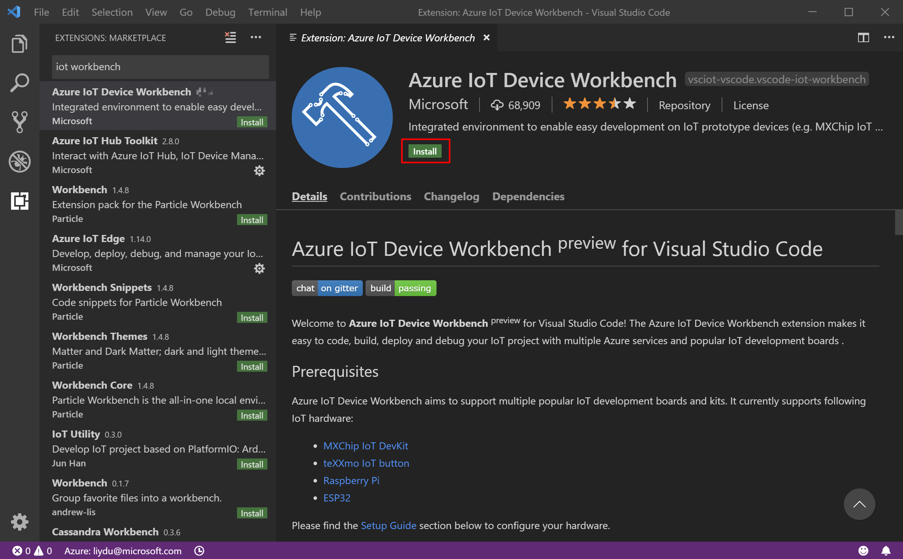
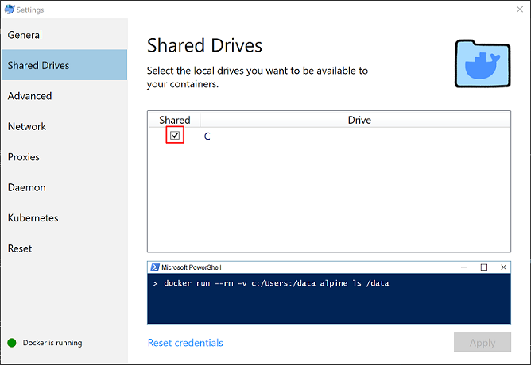
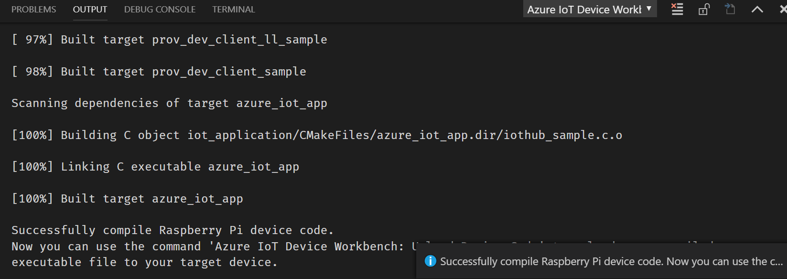
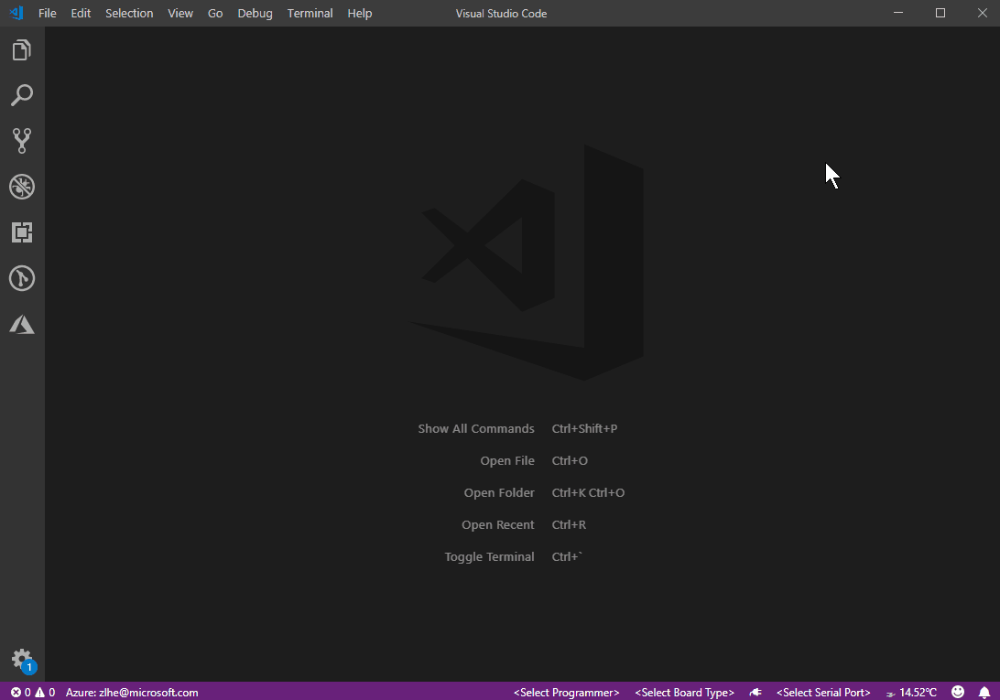

# Azure IoT Device Workbench for Visual Studio Code

[](https://gitter.im/Microsoft/vscode-iot-workbench)
[](https://travis-ci.org/Microsoft/vscode-iot-workbench)


The **Azure IoT Device Workbench** is an extension in Visual Studio Code that provides an integrated environment to code, build, deploy and debug your IoT device project with multiple Azure services supported.

## Device platforms and languages supported

Azure IoT Device Workbench aims to support multiple device platforms and its devices. Currently the following device platforms and languages are supported :

### Embedded Linux <sup>preview</sup>

Languages supported: `C/C++`

Devices supported: [Cortex-A series](https://developer.arm.com/ip-products/processors/cortex-a) devices (e.g. Raspberry Pi, NXP i.MX6) that are running Embedded Linux such as Debian, Ubuntu or Yocto Linux.

### Arduino

Languages supported: `Arduino C/C++`

Devices supported:

- [MXChip IoT DevKit](https://aka.ms/iot-devkit)
- [ESP32](https://www.espressif.com/en/products/hardware/esp-wroom-32/overview)
- [teXXmo IoT button](https://aka.ms/button)

Please help to take the [survey](https://www.surveymonkey.com/r/C7NY7KJ) to let us know extra device platforms and languages you want to have for Device Workbench.

## Installation

### Prerequisites

For developing on Embedded Linux device, you will need Docker and Visual Studio Code version with [Visual Studio Code Remote Development](https://aka.ms/vscode-remote) to compile the device code in the [containerized device toolchain](https://aka.ms/iot-device-cube).

- [Visual Studio Code](https://code.visualstudio.com/), with version >= 1.35.1.
- [Docker Desktop / CE](https://www.docker.com/get-started).

### Install extensions

1. Launch VS Code, in the Extension tab, find and install **"Azure IoT Device Workbench"**.

    

2. Reload the window and make sure all the dependency extensions are correctly installed:

   - Azure Account
   - Azure IoT Hub Toolkit
   - C/C++
   - IoT Device Cube
   - Remote Development

### Install Docker

[VS Code Remote](https://aka.ms/vscode-remote) needs Docker runtime installed in order to use local containers, which is required for developing Embedded Linux devices in the Device Workbench.

- Install Docker Desktop for Windows

  Follow the [installation guide](https://docs.docker.com/docker-for-windows/install/) and make sure to enable driver sharing for Docker to access your local folder:

  1. Right click the **Docker** icon in the task try and select "Settings".
  2. Click on the "Shared Drivers" section and choose the driver to be shared.

     

- Install Docker Desktop for Mac

  Follow the [installation guide](https://docs.docker.com/docker-for-mac/install/) and make sure to enable driver sharing for Docker to access your local folder:
    *[TBD for Mac]*

- Get Docker for Linux

  Linux is a highly variable environment and the large number of server, container, and desktop distributions can make it difficult to know what is supported. Please check this [tutorial](https://code.visualstudio.com/docs/remote/linux) for Linux support.

## Usage

Depending on the device platform you choose, follow the resources below to develop on it.

### Embedded Linux <sup>preview</sup>

To simplify the cross compiling toolchain, Azure IoT Device SDK and dependencies setup and configuration, Device Workbench put all these components in the container. All cross-compiling works happen in it. Here is the quick start of using it to develop and compile a simple device app written in C and running on [Raspberry Pi 3 Model B+](https://www.raspberrypi.org/products/raspberry-pi-3-model-b-plus/) to send telemetry data to Azure IoT Hub.

#### Create new project

1. Within VS Code, press `F1` to open the command palette, then type and select **Azure IoT Device Workbench: Create Project...**.

2. Select the working folder (only for the first time) and enter the name of your project.

3. Select **Embedded Linux** from device platform list.

4. Select the dev container based on your target device, in this sample, select **32-bit Armv7 Cortex-A** for Raspberry Pi 3 Model B+ running Raspbian.

5. For the first time, it takes around 1 to 3 mintues depending on your Internet speed to download and prepare the dev container. You can click the **details** link on the notification for the progress:

     

6. Once the dev container is ready, VS Code will open a new window with project files the sample code.

#### Compile the code

1. The `iothub_sample.c` under the `src` subfolder is the source file contains the logic. You can modify or add your own code in it.

    

2. To compile the code, press `F1`, type and select **Azure IoT Device Workbench: Compile Device Code** from the command palette.

3. The cross-compiling of the code happens in the dev container. Once its done, it pops up the notification.
    

#### Upload to target device

1. Before upload the executable binary file to the target device, please make sure:

   - The running OS on the device is correct (e.g. Raspbian running on Raspberry Pi 3 Model B+).
   - The SSH is enabled on the device. Follw this [instructions](https://itsfoss.com/ssh-into-raspberry/) to do so.
   - Get the IP address of the device so that you can deploy the compiled binary to the device via SSH.

2. In VS Code, press `F1`, type and select **Azure IoT Device Workbench: Upload Device Code** from the command palette, then select **Manual setup** and enter IP address, port, user name and password to deploy the compiled binary via SSH to Raspberry Pi.

   

#### Verify the result

1. To start running the deployed binary, SSH into your Raspberry Pi device. You can follow this [instruction](https://itsfoss.com/ssh-into-raspberry/) to do so.

2. You need to copy the device connection as the parameter to run the app, follow [this guide](./docs/create-iothub-device.md) to use Azure IoT Hub Toolkit to do so.

3. Run the `azure_iot_app [connection string]` and you will see the Raspberry Pi start sending telemetry data to the Azure IoT Hub.

4. To verify the receive of the data, 

### Arduino

Currently, Device Workbench supports MXChip IoT DevKit, ESP32 DevKits and teXXmo IoT Button using Arduino. For generic Arduino device, we recommend to use [Arduino extension in VS Code](https://marketplace.visualstudio.com/items?itemName=vsciot-vscode.vscode-arduino).

#### MXChip IoT DevKit

Follow the [setup guide](https://docs.microsoft.com/en-us/azure/iot-hub/iot-hub-arduino-iot-devkit-az3166-get-started#prepare-the-development-environment) to setup the environment including the Arduino extension.

Here are a set of tutorials that will help you get started:

- [Get Started](https://docs.microsoft.com/en-us/azure/iot-hub/iot-hub-arduino-iot-devkit-az3166-get-started)
- [Use Azure IoT Hub Device Provisioning Service auto-provisioning device with IoT Hub](https://docs.microsoft.com/en-us/azure/iot-dps/how-to-connect-mxchip-iot-devkit)
- [Connect to the Remote Monitoring solution accelerator](https://docs.microsoft.com/en-us/azure/iot-accelerators/iot-accelerators-arduino-iot-devkit-az3166-devkit-remote-monitoring-v2)
- [Translate voice message with Azure Cognitive Services](https://docs.microsoft.com/en-us/azure/iot-hub/iot-hub-arduino-iot-devkit-az3166-translator)
- [Retrieve a Twitter message with Azure Functions](https://docs.microsoft.com/en-us/azure/iot-hub/iot-hub-arduino-iot-devkit-az3166-retrieve-twitter-message)
- [Send messages to an MQTT server using Eclipse Paho APIs](https://docs.microsoft.com/en-us/azure/iot-hub/iot-hub-arduino-iot-devkit-az3166-mqtt-helloworld)
- [DevKit State](./docs/iot-devkit/devkit-state.md)
- [Door Monitor](./docs/iot-devkit/devkit_door_monitor.md)
- [DevKit OTA](./docs/iot-devkit/devkit-ota.md)
- [Stream Analytics and Cosmos DB](./docs/iot-devkit/devkit-stream-analytics-cosmos-db.md)

#### ESP32

Follow the [setup guide](docs/esp32.md) to setup ESP32 device including the Arduino extension.

Here are a set of tutorials that will help you get started:

- [Get Started](./docs/esp32/esp32-get-started.md)
- [Stream Analytics and Cosmos DB](./docs/esp32/esp32-stream-analytics-cosmos-db.md)
- [ESP32 State](./docs/esp32/esp32-state.md)
- [M5Stack Email Receiver](./docs/esp32/m5stack-email-receiver.md)

#### teXXmo IoT button

- [Get Started](./docs/iot-button/teXXmo_IoT_button_get_started.md)

## Commands

*[TBD]*

| Command | Description |
| --- | --- |
| `Azure IoT Device Workbench: Create Project...`  | Create new IoT Device Workbench projects. |
| `Azure IoT Device Workbench: Open Examples... ` | Load existing examples of IoT Device Workbench project. |
| `Azure IoT Device Workbench: Provision Azure Services...` | Provison Azure services for current project. |
| `Azure IoT Device Workbench: Deploy to Azure...`  | Deploy the code of the Azure services. |
| `Azure IoT Device Workbench: Compile Device Code`  | Compile device code. |
| `Azure IoT Device Workbench: Upload Device Code`  | Compile and upload device code. |
| `Azure IoT Device Workbench: Configure Device Settings...`  | Manage the settings on the device. |
| `Azure IoT Device Workbench: Install Device Compiler Toolchain...`  | Install device compiler toolchain. |
| `Azure IoT Device Workbench: Set Workbench Path` | Set the default path for Azure IoT Device Workbench. |
| `Azure IoT Device Workbench: Help` | Get help for Azure IoT Device Workbench. |

### Create Project



### Provision Azure Services


### Open Examples


#### Note: 
-  When invoking the **Azure IoT Device Workbench: Provision Azure Services...** command with Azure IoT Hub and Azure Functions, by default, Azure Functions would use the IoT Hub consumer group of `$Default`. To switch to another consumer group, please follow the [guide](https://docs.microsoft.com/en-us/azure/iot-hub/iot-hub-create-through-portal) to create a new consumer group in Azure Portal. Then in IoT project, modify the following setting in **function.json**:
    ```
    "consumerGroup": "[consumer_group_name]"
    ```
-  You may open an existing IoT project after you close it. To do so:
    -  In the menu of **Visual Studio Code**, choose *File -> Open Workspace...* .
    -  In file selection panel, navigate to the folder that contains your project and select *{PROJECT_NAME}.code-project*.

        
    -  Click **Open**.

## Privacy Statement
The [Microsft Enterprise and Developer Privacy Statement](https://www.microsoft.com/en-us/privacystatement/EnterpriseDev/default.aspx) describes the privacy statement of this software.

## Contributing
There are a couple of ways you can contribute to this repo:

- **Ideas, feature requests and bugs**: We are open to all ideas and we want to get rid of bugs! Use the Issues section to either report a new issue, provide your ideas or contribute to existing threads.
- **Documentation**: Found a typo or strangely worded sentences? Submit a PR!
- **Code**: Contribute bug fixes, features or design changes:
  - Clone the repository locally and open in VS Code.
  - Install [TSLint for Visual Studio Code](https://marketplace.visualstudio.com/items?itemName=eg2.tslint).
  - Open the terminal (press <code>Ctrl + &#96;</code>) and run `npm install`.
  - To build, press `F1` and type in `Tasks: Run Build Task`.
  - Debug: press `F5` to start debugging the extension.
  - Run `gts check` and `gts fix` to follow TypeScript style guide.  
- **Example**: Contribute examples for the supported devices.

  - Create a git repo to host the code of your example project.
  - Write a tutorial to describe how to run the example.
  - Submit a [new issue](https://github.com/Microsoft/vscode-iot-workbench/issues/new) and provide the following information:
  
    | Item | Description |
    | --- | --- |
    | `Name` | Name of the example to be displayed in example gallery. |
    | `Description` | A short statement to describe the example. |
    | `Location` | URL of the GitHub repo. |
    | `Image` | URL of the example image (size: 640*370) shown in the gallery, if not provided, the default image will be used. |
    | `Tutorial` | URL of tutorial that describes how to run the example. |
    | `Difficulty` | Difficulty of the example, easy, medium or difficult. |

## Code of Conduct
This project has adopted the [Microsoft Open Source Code of Conduct](https://opensource.microsoft.com/codeofconduct). For more information please see the [Code of Conduct FAQ](https://opensource.microsoft.com/codeofconduct/faq/#howadopt) or contact opencode@microsoft.com with any additional questions or comments.

## Contact Us
If you would like to help to build the best IoT experience with Azure IoT Device Workbench, you can reach us directly at [gitter chat room](https://gitter.im/Microsoft/vscode-iot-workbench).

## Telemetry
VS Code collects usage data and sends it to Microsoft to help improve our products and services. Read our [privacy statement](https://go.microsoft.com/fwlink/?LinkID=528096&clcid=0x409) to learn more. If you don’t wish to send usage data to Microsoft, you can set the `telemetry.enableTelemetry` setting to `false`. Learn more in our [FAQ](https://code.visualstudio.com/docs/supporting/faq#_how-to-disable-telemetry-reporting).


