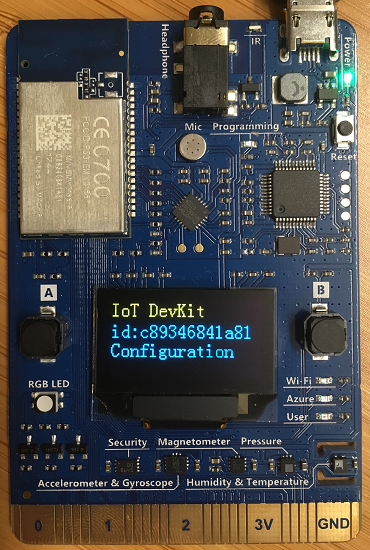
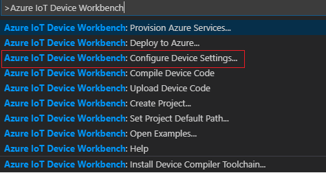

# Use IoT DevKit AZ3166 with IoT Hub to make OTA firmware update

In this tutorial, you learn how to let IoT DevKit to upgrade its firmware via IoT Hub.

## About IoT DevKit

The [MXChip IoT DevKit](https://aka.ms/iot-devkit) (a.k.a. IoT DevKit) is an all-in-one Arduino compatible board with rich peripherals and sensors. You can develop for it using [Azure IoT Workbench ](https://aka.ms/azure-iot-workbench). And it comes with a growing [projects catalog](https://aka.ms/devkit/project-catalog) to guide you prototype Internet of Things (IoT) solutions that take advantage of Microsoft Azure services.

## What you need

Finish the [Getting Started Guide](./devkit-get-started.md) to:

* Have your DevKit connected to Wi-Fi.
* Prepare the development environment.

An active Azure subscription. If you do not have one, you can register via one of these two methods:

* Activate a [free 30-day trial Microsoft Azure account](https://azure.microsoft.com/free/).
* Claim your [Azure credit](https://azure.microsoft.com/pricing/member-offers/msdn-benefits-details/) if you are MSDN or Visual Studio subscriber.

## Open the project folder

### Start VS Code

* Make sure your DevKit is not connected to your PC.
* Start VS Code.
* Connect the IoT DevKit to your computer.
* Make sure [Azure IoT Workbench](https://marketplace.visualstudio.com/items?itemName=vsciot-vscode.vscode-iot-workbench) is installed.

### Open IoT Workbench Examples

Use `F1` or `Ctrl+Shift+P` (macOS: `Cmd+Shift+P`) to open the command palette, type **IoT Workbench**, and then select **IoT Workbench: Examples**.


Select **IoT DevKit**.


Then the **IoT Workbench Example** window is showed up.


Find **Firmware OTA** and click **Open Sample** button. A new VS Code window with a project folder in it opens.


## Provision Azure service

In the solution window, open the command palette and select **IoT Workbench: Cloud**.


Select **Azure Provision**.


Then VS Code guides you through provisioning the required Azure services.


The whole process includes:
* Select an existing IoT Hub or create a new IoT Hub.
* Select an existing IoT Hub device or create a new IoT Hub device. 

## Config IoT Hub Connection String

1. Switch the IoT DevKit into **Configuration mode**. To do so:

   - Hold down button **A**.
   - Push and release the **Reset** button.

2. The screen displays the DevKit ID and 'Configuration'.

	 

3. Open the command palette and select **IoT Workbench: Device**.

	

4. Select **Config Device Settings**.

	

5. Select **Select IoT Hub Device Connection String**.

	

   This sets the connection string that is retrieved from the `Provision Azure services` step.

6. The configuration success notification popup bottom right corner once it's done.

     

## Build and upload the device code

1. Open the command palette and select **IoT Workbench: Device**, then select **Device Upload**.

	

2. VS Code then starts verifying and uploading the code to your DevKit.

	

3. The DevKit reboots and starts running the code.

## Test the project
In order to trigger firmware update event on DevKit, you need to use Azure portal to set automatic device management configuration.

1. In the [Azure portal](https://portal.azure.com), go to your IoT hub.

2. In Section **AUTOMATIC DEVICE MANAGEMENT**, select **IoT device configuration**.

3. Select **Add Configuration** and create a new configuration.

	

4. Give your OTA configuration a unique name, for example, "ota-firmware-update", and add labels to help track our configurations if necessary. Select **Next** to move to next step.

	

5. Specifies the target content to be set in targeted device twins. Set **Device Twin Path** as "properties.desired.firmware", and set **Content** in the following JSON format:

	```json
	{
		"fwVersion": "1.3.7.56",
		"fwPackageURI": "https://azureboard2.azureedge.net/prod/devkit-firmware-1.3.7.56.bin",
		"fwPackageCheckValue": "AAAA",
		"fwSize": 0
	}
	```

	Download the firmware from the URL. Run **CRC16Calculator.exe**(or **CRC16Calculator.out** in Mac) in command line, and set the path to the downloaded firmware .bin file as running argument. You would see the size of the .bin file and its CRC-16 checksum represented in 4-digit hexadecimal form.
	
	
	
	Set them as the value of **fwPackageCheckValue** and **fwSize** in desired properties of JSON twin. Select **Next** to move to next step.

	

6. Select **Next** to skip step 3 of creating configuration. In step 4, set the **Priority** of the configuration as 10, and set **Target Condition** as "*", which means that the configuration would target all devices. Select **Next**.

	

7. In step 5, review your configuration information, then select **Submit**.

If DevKit is currently connected to a WiFi network, it would get the firmware update information and start to download and verify the firmware specified in the URL. During the whole update process, the device will report its status to IoT Hub via device twin. 


To see the reported status,

1. In Section **EXPLORERS** in your IoT Hub portal, select **IoT devices**, then select your device by its device id in the list.

	

2. Select **Device Twin** tab.

	

3. In **Device Twin** tab you will see the complete device twin JSON of your device. In **"reported"** object you will see the reported status of the OTA process.

	

After the process the device would restart automatically and apply the new firmware to the device.