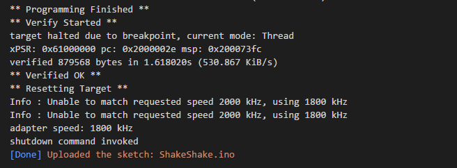
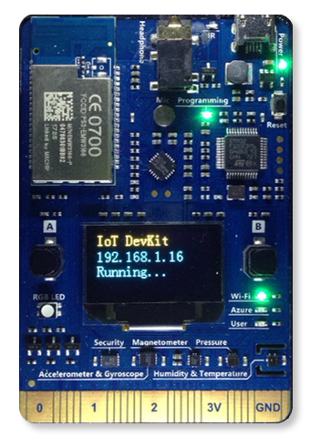
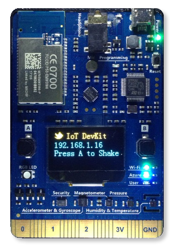
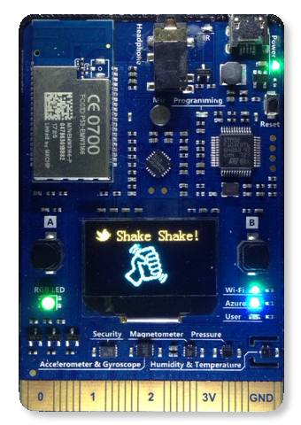
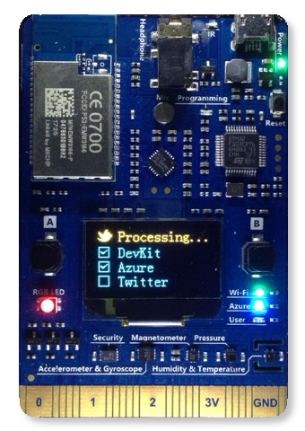
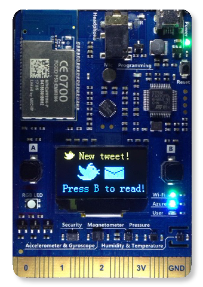
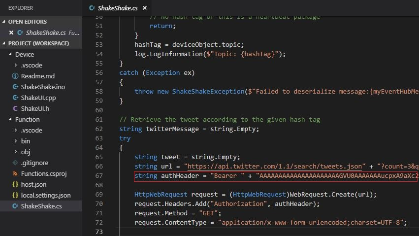

# Shake, Shake for a Tweet -- Retrieve a Twitter message with Azure Functions!

In this tutorial, you learn how to use the motion sensor to trigger an event using Azure Functions. The app retrieves a random tweet with a #hashtag you configure in your Arduino sketch. The tweet displays on the IoT DevKit screen.

## About IoT DevKit

The [MXChip IoT DevKit](https://aka.ms/iot-devkit) (a.k.a. IoT DevKit) is an all-in-one Arduino compatible board with rich peripherals and sensors. You can develop for it using [Azure IoT Workbench ](https://aka.ms/azure-iot-workbench). And it comes with a growing [projects catalog](https://aka.ms/devkit/project-catalog) to guide you prototype Internet of Things (IoT) solutions that take advantage of Microsoft Azure services.

## What you need

Finish the [Getting Started Guide](./devkit-get-started.md) to:

- Have your DevKit connected to Wi-Fi.
- Prepare the development environment.

An active Azure subscription. If you do not have one, you can register via one of these two methods:

- Activate a [free 30-day trial Microsoft Azure account](https://azure.microsoft.com/free/).
- Claim your [Azure credit](https://azure.microsoft.com/pricing/member-offers/msdn-benefits-details/) if you are MSDN or Visual Studio subscriber.

## Open the project folder

### Start VS Code

- Start Visual Studio Code.
- Make sure [Azure IoT Workbench](https://marketplace.visualstudio.com/items?itemName=vsciot-vscode.vscode-iot-workbench) is installed.
- Connect IoT DevKit to your PC.

### Open IoT Workbench Examples

Use `F1` or `Ctrl+Shift+P` (macOS: `Cmd+Shift+P`) to open the command palette, type **IoT Workbench**, and then select **IoT Workbench: Examples**.


Select **IoT DevKit**.


Then the **IoT Workbench Example** window is shown up.


Find **Shake, Shake for a Tweet** and click **Open Sample** button. A new VS Code window with a project folder in it opens.


## Provision Azure services

In the solution window, open the command palette and select **IoT Workbench: Cloud**.


Select **Azure Provision**.


Then VS Code guides you through provisioning the required Azure services.


The whole process includes:

- Select an existing IoT Hub or create a new IoT Hub.
- Select an existing IoT Hub device or create a new IoT Hub device. 
- Create a new Function App.

## Modify the #hashtag

Open `ShakeShake.ino` and look for this line of code:

```cpp
static const char* iot_event = "{\"topic\":\"iot\"}";
```

Replace the string `iot` within the curly braces with your preferred hashtag. DevKit later retrieves a random tweet that includes the hashtag you specify in this step.

## Modify code for Azure Functions
Open **shakeshake\run.csx** and look for this line of code::
```cpp
    string deviceName = "AZ3166";
```

Replace **AZ3166** with the device name you provisioned in previous step.

## Deploy Azure Functions

Open the command palette and select **IoT Workbench: Cloud**, then select **Azure Deploy**.


## Config IoT Hub Connection String

1. Switch the IoT DevKit into **Configuration mode**. To do so:

   - Hold down button **A**.
   - Push and release the **Reset** button.

2. The screen displays the DevKit ID and 'Configuration'.

    

3. Open the command palette and select **IoT Workbench: Device**.

   

4. Select **Config Device Settings**.

   

5. Select **Select IoT Hub Device Connection String**.

   

   This sets the connection string that is retrieved from the `Provision Azure services` step.

6. The configuration success notification popup bottom right corner once it's done.

    

## Build and upload the device code

1. Open the command palette and select **IoT Workbench: Device**, then select **Device Upload**.

   

2. VS Code then starts verifying and uploading the code to your DevKit.

   

3. The IoT DevKit reboots and starts running the code.

## Test the project

After app initialization, click and release button **A**, then gently shake the DevKit board. This action retrieves a random tweet, which contains the hashtag you specified earlier. Within a few seconds, a tweet displays on your DevKit screen:

**Arduino application initializing...**


**Press A to shake...**


**Ready to shake...**


**Processing...**


**Press B to read...**


**Display a random tweet...**


- Press button **A** again, then shake for a new tweet.
- Press button **B** to scroll through the rest of the tweet.

## How it works


The Arduino sketch sends an event to the Azure IoT Hub. This event triggers the Azure Functions app. Azure Functions app contains the logic to connect to Twitter's API and retrieve a tweet. It then wraps the tweet text into a C2D (Cloud-to-device) message and sends it back to the device.

## Optional: Use your own Twitter bearer token

For testing purposes, this sample project uses a pre-configured Twitter bearer token. However, there is a [rate limit](https://dev.twitter.com/rest/reference/get/search/tweets) for every Twitter account. If you want to consider using your own token, follow these steps:

1. Go to [Twitter Developer portal](https://dev.twitter.com/) to register a new Twitter app.

2. [Get Consumer Key and Consumer Secrets](https://support.yapsody.com/hc/en-us/articles/203068116-How-do-I-get-a-Twitter-Consumer-Key-and-Consumer-Secret-key-) of your app.

3. Use [some utility](https://gearside.com/nebula/utilities/twitter-bearer-token-generator/) to generate a Twitter bearer token from these two keys.

4. Update the following line in `shakeshake/run.csx` with your own token:



	```csharp
	...
	string authHeader = "Bearer " + "[your own token]";
	...
	```


5. Open the command palette and select **IoT Workbench: Cloud**, then select **Azure Deploy**.

## Next Steps

Now you make the IoT DevKit as a Twitter Reader by using Azure Functions.

Check our [Projects Catalog](https://aka.ms/devkit/project-catalog) for more samples you can build with the IoT DevKit and Azure multiple services.