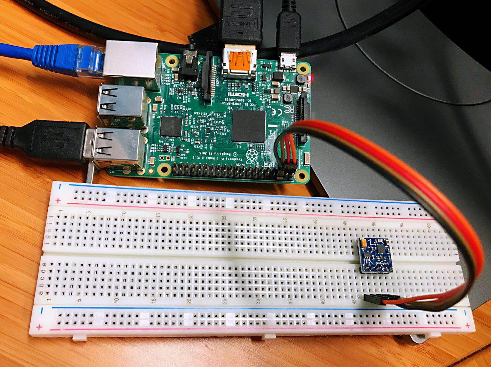
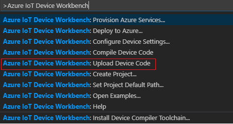
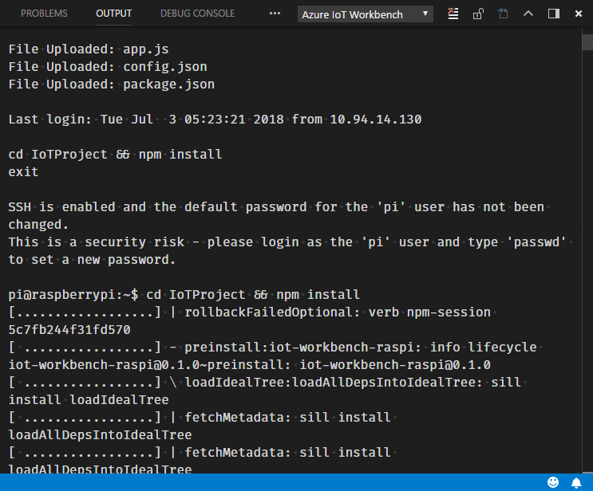
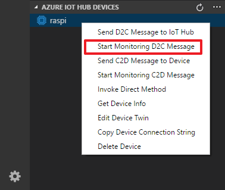

# Get Started with Raspberry Pi

Follow these quick steps to:
- Prepare your development environment.
- Send magnetoresistive sensor data from [GY-271 electronic compass](http://www.robotpark.com/image/data/PRO/91457/GY_271_ELECTRONIC_COMPASS.pdf) to the Azure IoT Hub.

## What you learn

* How to install the development environment.
* How to create an IoT Hub and register a device for Raspberry Pi.
* How to collect sensor data by running a sample application on Raspberry Pi.
* How to send sensor data to your IoT hub.

## What you need

* A Raspberry Pi.
* Enable SSH on Raspberry Pi and install Node.js. You can follow [this documentation](https://www.w3schools.com/nodejs/nodejs_raspberrypi.asp).
* A GY-271 electronic compass.
* A computer running Windows 10 or macOS 10.10+.
* An active Azure subscription. [Activate a free 30-day trial Microsoft Azure account](https://azure.microsoft.com/en-us/free/).


## Prepare your hardware

Connect GY-271 to Raspberry Pi:

You can find Raspberry Pi GPIO pin mapping from <https://www.raspberrypi.org/documentation/usage/gpio/>.

GY-271 has 5 pins: VCC, GND, SCL, SDA and DRDY. Connect them to Raspberry Pi GPIO pins as below table:

| GY-271 Pin | Raspberry Pi GPIO |
| ---------- | ----------------- |
| VCC        | 3.3v              |
| GND        | Ground            |
| SCL        | 3                 |
| SDA        | 2                 |
| DRDY       | Not Connect       |



## Install development environment

Azure IoT Device Workbench provides an integrated experience to develop IoT solutions. It helps both on device and cloud development using Azure IoT and other services. You can watch this [Channel9 video](https://channel9.msdn.com/Shows/Internet-of-Things-Show/IoT-Workbench-extension-for-VS-Code) to have an overview of what it does.

Follow these steps to prepare the development environment for Raspberry Pi:

1. Install [Visual Studio Code](https://code.visualstudio.com/), a cross platform source code editor with powerful developer tooling, like IntelliSense code completion and debugging.

2. Look for **Azure IoT Device Workbench** in the extension marketplace and install it.

  

Together with the Azure IoT Device Workbench, other dependent extensions will be installed.

## Build your first project

Now you are all set with preparing and configuring your development environment. Let us build a "Hello World" sample for IoT: sending temperature telemetry data to Azure IoT Hub.

### Open Azure IoT Device Workbench Examples

Use `F1` or `Ctrl+Shift+P` (macOS: `Cmd+Shift+P`) to open the command palette, type **Azure IoT Device Workbench**, and then select **Open Examples...**.


Select **Raspberry Pi**.
    


Then the **IoT Device Workbench Example** window is shown up.
    


Find **Get Started** and click **Open Sample** button. A new VS Code window with a project folder in it opens.


### Provision Azure service

In the solution window, open the command palette and select **Azure IoT Device Workbench: Provision Azure Services...**.


Then VS Code guides you through provisioning the required Azure services.


The whole process includes:
* Select an existing IoT Hub or create a new IoT Hub.
* Select an existing IoT Hub device or create a new IoT Hub device. 

### Config IoT Hub Device Connection String

1. Open the command palette and select **Azure IoT Device Workbench: Configure Device Settings...**.

  

2. Select **Config connection of IoT Hub Device**.

  

3. Select **Select IoT Hub Device Connection String**.

  

   This sets the connection string that is retrieved from the `Provision Azure services` step.

4. The configuration success notification popup bottom right corner once it's done.

   

### Upload the device code

1. Open the command palette and select **Azure IoT Device Workbench: Configure Device Settings...**.

  

2. Select **Select Config Raspberry Pi SSH**.

  

3. Input Raspberry Pi host name or IP, ssh port, user name, password and project name.

4. Open the command palette and select **Azure IoT Device Workbench: Upload Device Code**.

  

5. VS Code then starts uploading the code to Raspberry Pi and install node modules.

  

6. Login Raspberry Pi and run node code.

Use command below to connect your Raspberry Pi with SSH. Change `pi` to your own user name, and `raspberrypi` to real Raspberry Pi host or IP.

```bash
ssh pi@raspberrypi
```

Then switch to the project folder, such as IoTProject.

```bash
cd IoTProject
```

Run the Node script.

```bash
node app.js
```

If you cannot execute ssh command in the terminal on Windows, you can use any other SSH client, such [PuTTY](https://www.putty.org/).

  

## Test the project

You can use [Azure IoT Hub Toolkit](https://marketplace.visualstudio.com/items?itemName=vsciot-vscode.azure-iot-toolkit) to monitor device-to-cloud (D2C) messages in IoT Hub:

1. Expand **AZURE IOT HUB DEVICES** on the bottom left corner, click the device that you have created at **Provision Azure service** step and open the context menu, then click **IoT: Start monitoring D2C message** in context menu.

  

2. In **OUTPUT** pane, you can see the incoming D2C messages to the IoT Hub.

  
